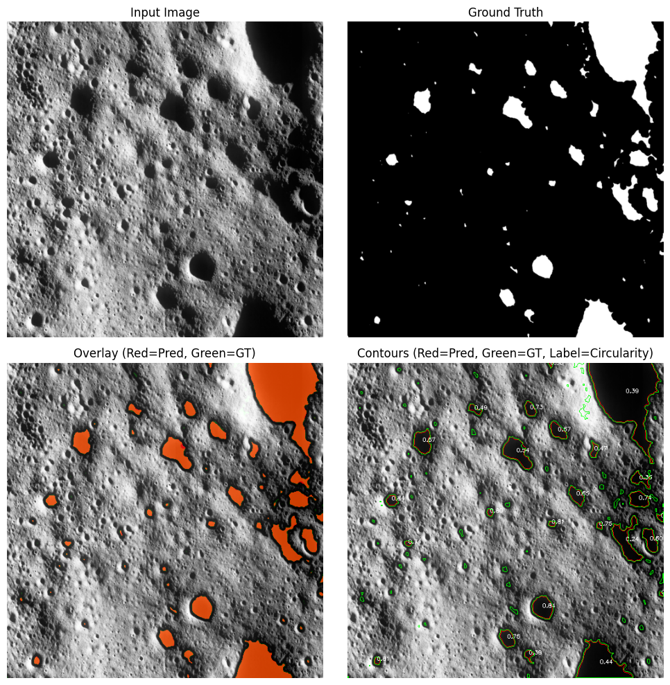

# 🛰️ Crater and Boulder Detection using Chandrayaan 2 OHRC using U-Net Architecture

A complete deep learning pipeline for automatic mask generation and semantic segmentation of OHRC satellite imagery using **U-Net + SAM (Segment Anything Model)**.

---

## 📌 Project Overview

This project builds an **end-to-end segmentation system** for high-resolution OHRC images.
The pipeline starts from raw compressed data and ends with **pixel-wise segmentation predictions and visual overlays**.

### 🔥 Key Highlights

* 📦 Automatic dataset extraction and organization
* ✂️ Image tiling into square patches
* 🤖 Automatic mask generation using SAM
* 🧠 U-Net based semantic segmentation
* 📊 Dice, IoU, Accuracy evaluation
* 🖼️ Rich visualization with contour analysis
* ⚡ Mixed precision training + early stopping

---

## 🎯 Problem Statement

Manual annotation of satellite imagery is expensive and time-consuming.

**Goal:**
Build an automated pipeline that:

1. Processes raw OHRC data
2. Generates segmentation masks
3. Trains a deep learning model
4. Produces accurate pixel-level predictions

---

## 🏗️ Project Pipeline

```
Raw ZIP Data
   ↓
Extraction & File Moving
   ↓
Image Squaring (1200×1200)
   ↓
Mask Generation (SAM)
   ↓
Train/Val/Test Split
   ↓
U-Net Training
   ↓
Evaluation Metrics
   ↓
Visualization & Contours
```

---

# 📁 Project Structure

```
OHRC-ISRO/
│
├── chandrayaan.png
├── dataset_preparation
│   ├── data_process.ipynb
│   ├── data_process.py          # Image tiling into squares
│   ├── dataset_split.ipynb
│   ├── dataset_split.py         # Train/val/test split
│   ├── dataset_utils.ipynb
│   ├── dataset_utils.py         # Extraction and file organization
│   ├── masks_generator.ipynb
│   └── masks_generator.py       # SAM-based mask creation
├── LICENSE
├── main.ipynb
├── main.py                      # Training, evaluation, visualization
└── best_model.pth               # Saved best model (during model training)
└── README.md
```

---

# ⚙️ Step-by-Step Workflow

---

## 1️⃣ Data Extraction and Organization

**File:** `data_utils.py`

### What it does

* Finds ZIP files in raw dataset
* Extracts `.img` files
* Moves them into structured folders

### Key Functions

* `find_and_extract()` → extracts ZIP contents
* `move_files()` → reorganizes dataset
* `list_immediate_subfolders()` → directory discovery

✅ Ensures raw OHRC data becomes usable.

---

## 2️⃣ Image Preprocessing (Square Tiling)

**File:** `data_process.py`

OHRC images are large and rectangular.

### Problem

Deep learning models require fixed-size inputs.

### Solution

* Split images into **1200×1200 square patches**
* Preserve folder structure
* Save tiled images

### Function

```python
create_squares_from_images(input_folder, output_folder)
```

✅ Produces model-ready image patches.

---

## 3️⃣ Automatic Mask Generation using SAM

**File:** `mask_generator.py`

This is the **most important innovation** in your pipeline.


### 🚀 Why SAM?

Manual mask labeling is costly.
We use **Meta's Segment Anything Model (SAM)** to auto-generate masks.


### 🔬 Mask Generation Pipeline

1. Load image
2. Run SAM automatic mask generator
3. Annotate masks
4. Convert to binary mask
5. Save mask


### Key Functions

* `create_mask()`
* `binarize_mask()`
* `process_dataset()`

✅ Result: Automatic ground truth masks.

---

## 4️⃣ Dataset Splitting

**File:** `data_split.py`

### Purpose

Create proper ML splits:

* Train: 80%
* Validation: 10%
* Test: 10%


### Important Features

* Maintains image-mask pairing
* Preserves directory structure
* Validates image width


### Function

```python
split_data(image_files, mask_files, output_folder)
```


✅ Ensures reliable model evaluation.

---

# 🧠 Model Architecture — U-Net

**File:** `main.py`


## ✨ Why U-Net?

U-Net is ideal for:

* Medical imaging
* Satellite segmentation
* Small datasets


## 🔷 Architecture Overview

Encoder → Bottleneck → Decoder with skip connections.

**Blocks used:**

* Conv2D
* BatchNorm
* ReLU
* MaxPool
* ConvTranspose

---

## 📉 Loss Function

Combined loss:

```
Loss = 0.5 × BCEWithLogitsLoss + 0.5 × Dice Loss
```

### Why combined?

* BCE → pixel accuracy
* Dice → overlap quality

✅ Better segmentation performance.

---

# 🚀 Training Strategy


## ⚡ Advanced Features Used

* Mixed precision (AMP)
* GradScaler
* ReduceLROnPlateau
* Early stopping
* GPU acceleration


## 🛑 Early Stopping

Training stops when validation loss stops improving.

From your run:

```
Early stopping triggered!
Best Validation Loss: 0.3419
```

✅ Prevents overfitting.

---

# 📊 Evaluation Metrics

The model is evaluated using:

* Dice Score
* IoU Score
* Pixel Accuracy


## 🧪 Your Final Results

| Metric   | Value      |
| -------- | ---------- |
| Dice     | **0.4255** |
| IoU      | **0.2707** |
| Accuracy | **0.9343** |


---

# 🖼️ Visualization System

The project generates rich visual outputs:

### Views Produced

* Input image
* Ground truth mask
* Overlay (Pred vs GT)
* Contour analysis with circularity

## 🎨 Special Visualization Features

* 🔴 Red = Prediction
* 🟢 Green = Ground Truth
* 🔵 Circularity label on contours


# 💻 How to Run the Project
### (Download the dataset from our ISRO website `pradan.issdc.gov.in`)

---

## 🔧 1. Install Dependencies

```bash
pip install torch torchvision
pip install opencv-python
pip install supervision
pip install segment-anything
pip install tqdm pandas matplotlib
```

---

## 📂 2. Prepare Dataset

Update paths in:

* `data_utils.py`
* `data_process.py`
* `data_split.py`
* `main.py`

---

## 🏃 3. Run Pipeline

### Step 1 — Extract data

```bash
python data_utils.py
```

### Step 2 — Create square patches

```bash
python data_process.py
```

### Step 3 — Generate masks

```bash
python mask_generator.py
```

### Step 4 — Split dataset

```bash
python data_split.py
```

### Step 5 — Train model

```bash
python main.py
```

---

# 📈 Future Improvements

You can improve performance by:

* 🔹 Data augmentation
* 🔹 Attention U-Net
* 🔹 Dice-only loss tuning
* 🔹 Larger input resolution
* 🔹 Better SAM filtering
* 🔹 Post-processing (morphology)
* 🔹 ConvLSTM + U-Net

---

# 🤝 Acknowledgements

* ISRO OHRC dataset
* Meta AI — Segment Anything Model
* 
---

# 📌 Output Sample



---

# 👨‍💻 Author

**Pon Ajith Kumar P**
AI/ML Enthusiast 🇮🇳

---
